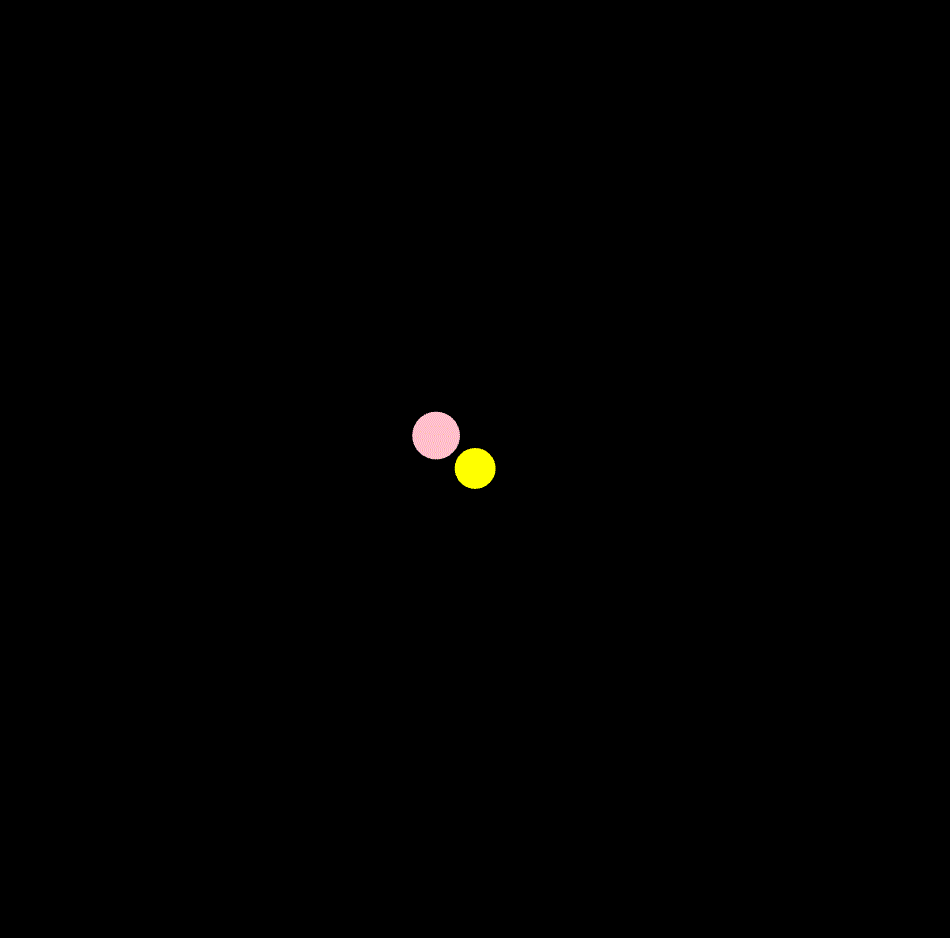

# Lorenz attractor

  

    

        The Lorenz attractor is a system described by a set of odinary differential equations (ODEs), with three variables (x, y, z) and three control parameters (σ, ρ, β). 
          
         
        dx/dt = σ(y - x) 
         
        dy/dt = x(ρ - z) - y 
         
        dz/dt = xy - βz
          
         
        It is worth mentioning that to code the representation, it is not necessary to solve the system. Instead, at each time step, the displacement of the variables is calculated and their values updated.
    

    

    
  

 

  

    

        As an ODE, the Lorenz attractor requires an initial set of variables to determine its trajectory. This initial condition represents the state of the system at a specific moment in time. 
          
         
        The system exhibits sensitive dependence on initial conditions. This means that small changes in the initial conditions can lead to large differences in the long-term behavior of the system.
    

    

    
  

 

  

    

        It is also really fun to play with for making interesting trajectories in animations 😀
    

    

    
  

---

🚂 Inspired by this amazing tutorial https://www.youtube.com/watch?v=f0lkz2gSsIk